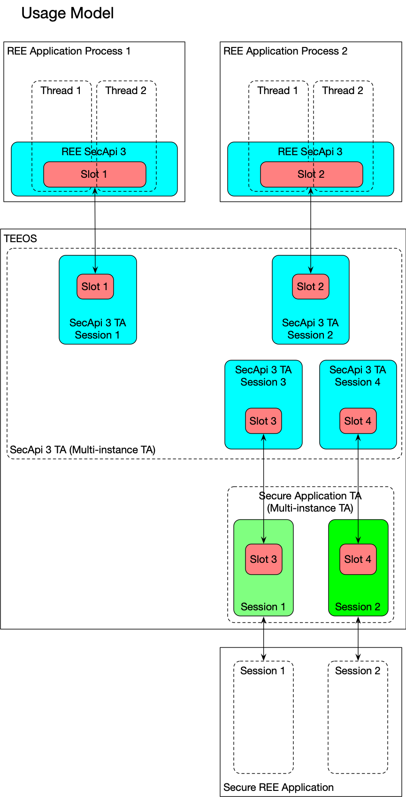

# SecAPI 3 Usage Model

This diagram shows the planned usage model for SecAPI 3. SecAPI 3 uses a slot for every REE
application thread.

A Rich Execution Environment (REE) application is any application that executes outside the bounds
of a Trusted Execution Environment (TEE).

A Trusted Application (TA) is any application that executes in a trusted execution environment.

SecAPI 3 is composed of two components: a SecAPI 3 REE library and a SecAPI 3 TA. The REE SecAPI 3
library provides an API for REE applications to call which delegates functionality to the SecAPI 3
TA. The SecAPI 3 TA provides an environment in which instruction execution and memory usage is not
visible outside the trusted application.

The following sections describes the different use cases shown in this model and assumes the
proposed threaded usage model.

## Requirements

* Any calls to the SecAPI 3 TA using different sessions shall be able to execute simultaneously
  within the SecAPI 3 TA.
* Any calls to the SecAPI 3 TA using the same session may execute sequentially and may block other
  calls to the SecAPI 3 TA within the same session.

## REE Application Use Case

A REE application will be compiled with the REE SecAPI 3 library. The REE application can be single
threaded or multi-threaded. The REE SecAPI 3 library is assigned a UUID identifying it as the REE
SecAPI 3 library.  On the first usage of SecAPI 3 by a thread, the REE SecAPI 3 library invokes
open session on the SecAPI 3 TA which looks up the UUID of the REE SecAPI 3 library.  This open
session invocation invokes the ta_sa_init function providing the UUID of the REE SecAPI library.
This assigns a slot number to the session. The TA may choose to store this slot number as part of
the session context so that it does not have to be submitted on future function invocations. All
future function invocations made by the REE SecAPI 3 library to the SecAPI 3 TA session will use
this UUID and slot number.  All keys, ciphers, macs, and SVP memory regions created in this session
are only accessible by function invocations using this session. When the REE SecAPI 3 library closes
the session, this likewise invokes ta_sa_close which releases the slot and any keys, ciphers, macs,
or SVP memory regions associated with it.

This SecAPI 3 session can only be used by the application thread that created it. Any other threads
in the same process that need to use the same key must import their own instance of the same key.
Threads must likewise create their own cipher, mac, and SVP memory region instances.

SVP memory regions cannot directly be shared between threads. However, an SVP memory region can be
allocated by one thread using the sa_svp_buffer_alloc function, released from that thread using
the sa_svp_buffer_release function, and assigned to another thread using the sa_svp_buffer_create
function.

Examples of REE Applications include:
* The SOC Provisioning application.
* Any application using the SecClient library.
* Potentially any application using TLS where the TLS library uses SecAPI 3 as its underlying
  cryptographic engine.

## Secure Application Use Case

A Secure REE application will interact with a Secure Application TA to perform secure functions. The
Secure Application TA interacts with the SecAPI 3 TA to perform cryptographic functions on its
behalf. A Secure Application TA is assigned a UUID at compile time to identify the type of the TA.
Keys can be assigned rights so that they can only be utilized by Secure Application TA instances
with that UUID.

On the first usage of SecAPI 3 by a Secure Application TA instance, the Secure Application TA
instance invokes open session on the SecAPI 3 TA which looks up the UUID of the Secure Application
TA. This open session invocation invokes the ta_sa_init function providing the UUID of the Secure
Application TA. This assigns a slot number to the session. The TA may choose to store this slot
number as part of the session context so that it does not have to be submitted on future function
invocations. All future function invocations made by the Secure Application TA instance to the
SecAPI 3 TA session will use this UUID and slot number.  All keys, ciphers, macs, and SVP memory
regions created in this session are only accessible by function invocations using this session. When
the Secure Application TA instance closes the session, this likewise invokes ta_sa_close which
releases the slot and any keys, ciphers, macs, or SVP memory regions associated with it.

This SecAPI 3 session can only be used by the Secure Application TA instance that created it. Any
other Secure Application TA instances that need to use the same key must import their own instance
of the same key. Threads must likewise create their own cipher, mac, and SVP memory region
instances.

SVP memory regions cannot directly be shared between Secure Application TA instances. However, an
SVP memory region can be allocated by one thread using the sa_svp_buffer_alloc function, released
from that thread using the sa_svp_buffer_release function, and assigned to another thread using the
sa_svp_buffer_create function.

Any calls to the SecAPI 3 TA using different sessions shall be able to execute simultaneously
within the SecAPI 3 TA.  Any calls to the SecAPI 3 TA using the same session may execute
sequentially and may block other calls to the SecAPI 3 TA using the same session.

Examples of Secure Application TAs include:
* Widevine v16 DRM TA.
* PlayReady 4.4 DRM TA.
* Any other future TA that needs access to SecAPI 3.
